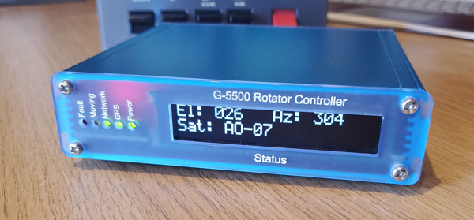

# pi-rotator
The GS-232 costs far too much, so here's a simple Pi based antenna rotator which uses through-hole components wherever possible

The project is CC-BY-SA 



This project is currently still EXPERIMENTAL until the board design is finalised, and the driver software made more useful.


Getting Started:


pirotator is installed in the default user home directory - you can change this if you want.

Create the pirotator directory and change into it:

````
mkdir /home/pi/pirotator
cd /home/pi/pirotator
````


extract the contents of the repository folder ./home/pirotator to /home/pi/pirotator (this contains config.xml, start.sh, etc)

Then, make start.sh executable (if it is not already):

````
chmod u+x start.sh
````

install java 8 (java11+ support available once pi4j is updated):
 
````
sudo apt install openjdk-8-jdk
````


Copy the pirotator.service to systemd (only if you want to start at boot):

````
sudo cp pirotator.service /etc/systemd/system/pirotator.service
````

Then, enable the service

````
sudo systemctl enable pirotator.service
````

After that you should be good to go and can type:

````
sudo service pirotator.service start
````


To enable PPS + GPS + NTPd so you can have your own stratum one equivalent server:

Install the relevant bits:

````
sudo apt install gpsd gpsd-clients python-gi-cairo pps-tools ntp
````


Add this to /boot/config.txt

````
dtoverlay=pps-gpio,gpiopin=4,capture_clear
````